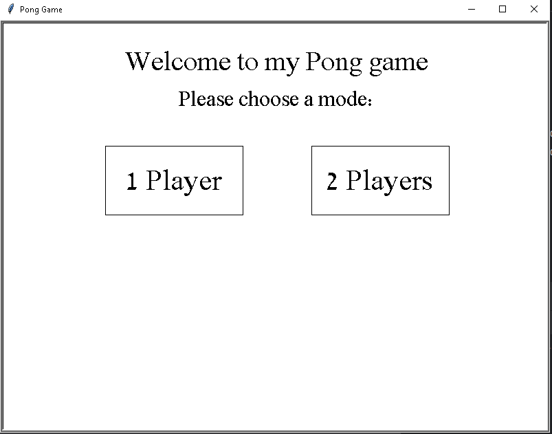
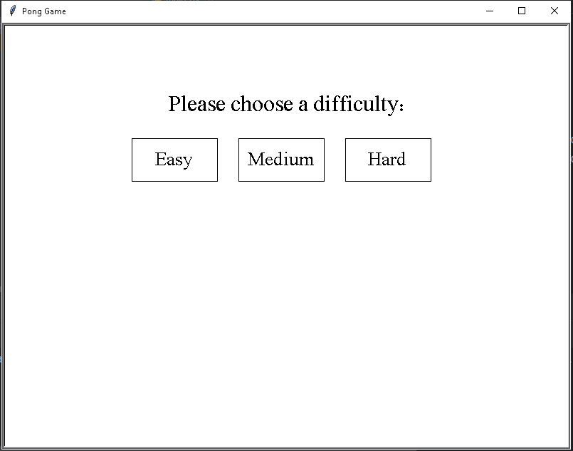
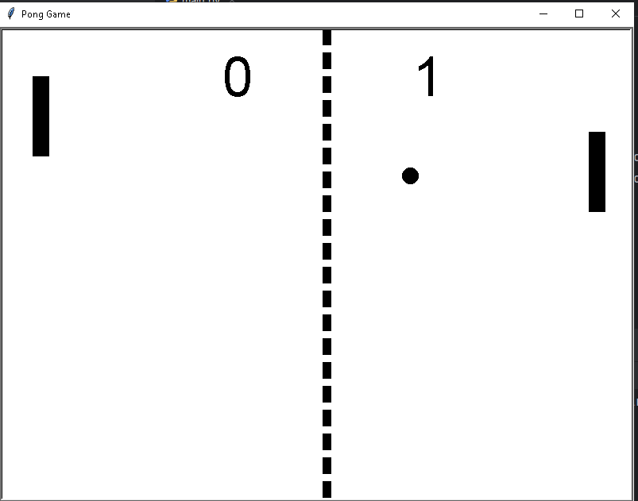
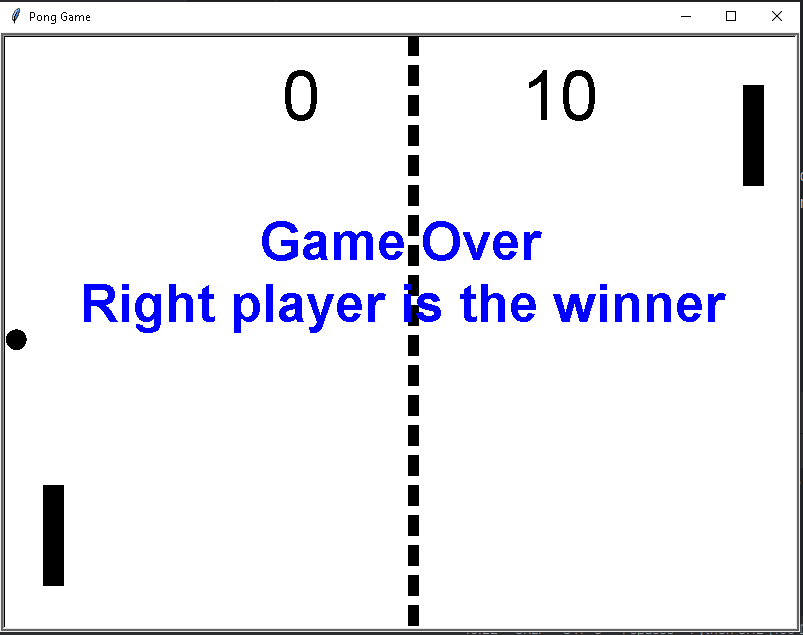

# Pong Game

## Project Overview
Pong Game is a classic arcade game implemented using Python's Turtle graphics.
The game features both single-player and two-player modes, allowing players to compete against each other or against a computer opponent with adjustable difficulty levels.
The objective is to score points by getting the ball past the opposing paddle.

## Features
- **Game Modes**: 
  - **Single-player**: Play against the computer with selectable difficulty (Easy, Medium, Hard).
  - **Two-player**: Compete against a friend using keyboard controls.
  
- **Dynamic Gameplay**: The ball bounces off walls and paddles, and players score points when the opponent fails to return the ball.

- **Scoreboard**: Tracks and displays the current score for both players.

- **User-friendly Menu**: Choose game modes and difficulty levels with an interactive menu.

## Screenshots

### Menu

### Difficulties

### Gameplay

### Game Over

