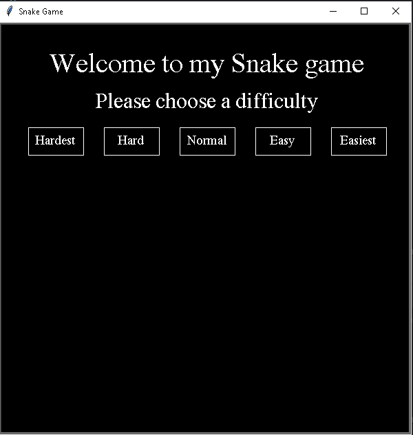
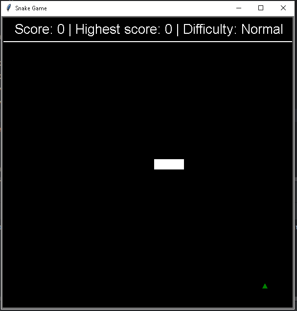
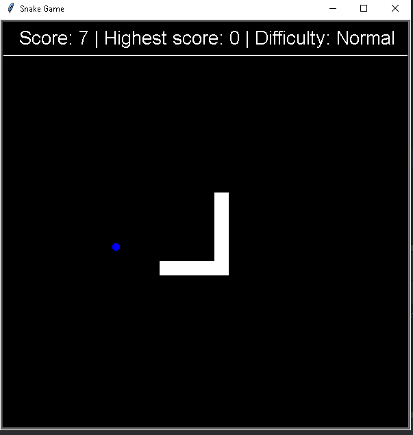
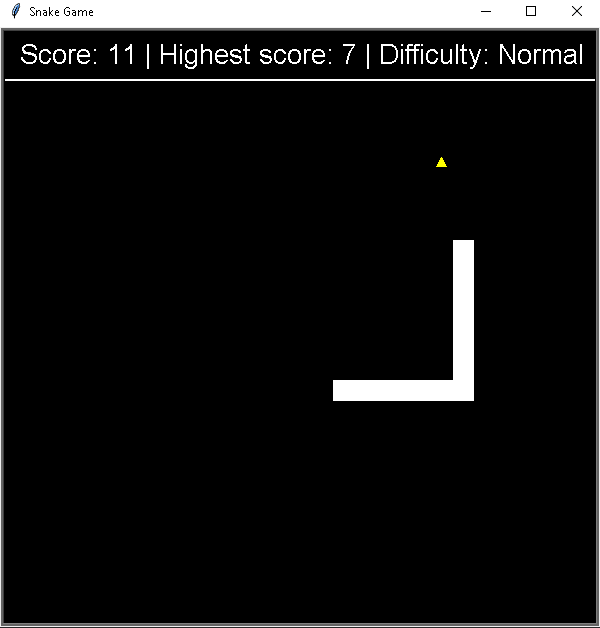
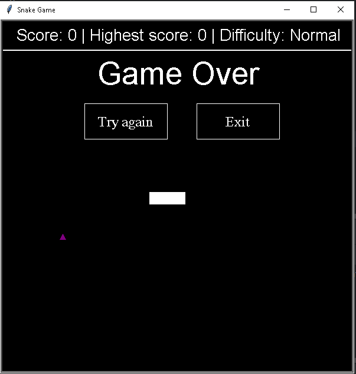

# Snake Game

## Overview
This is a classic Snake game implemented in Python using the Turtle graphics library.
Players control a snake that grows in length each time it eats food while avoiding collisions with the walls and itself.
The game features a menu for selecting difficulty levels and a scoreboard to track the player's score.

## Features
- Difficulty levels: Choose from five difficulty settings.
- Dynamic gameplay: The snake grows longer as it eats food, making it more challenging.
- Score tracking: Displays the current score and the highest score achieved for each difficulty level.
- Replay option: After a game over, players can choose to play again or exit.

## Technologies Used
- Python 3
- Turtle graphics library

## Screenshots

